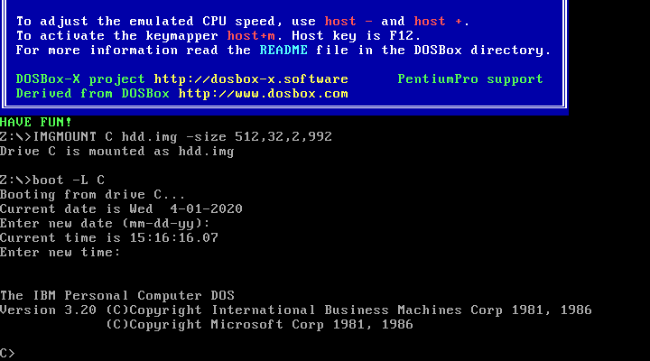
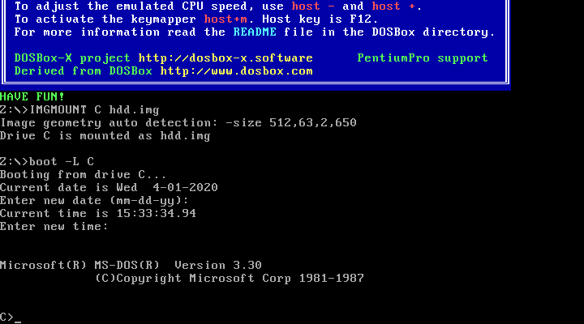
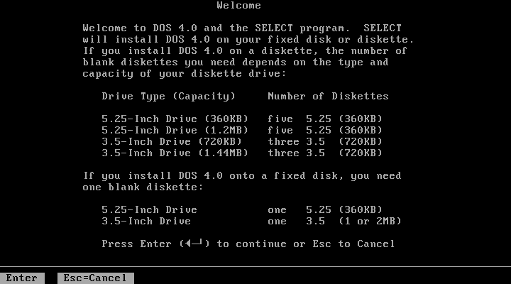
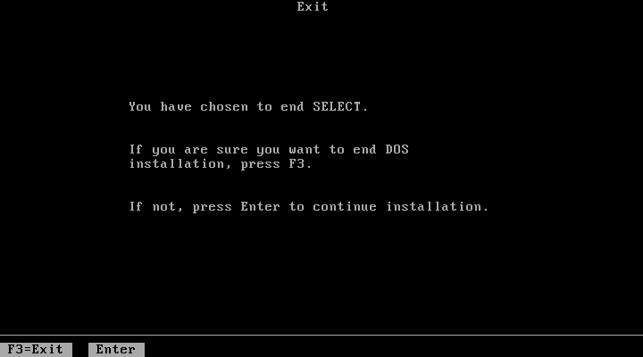
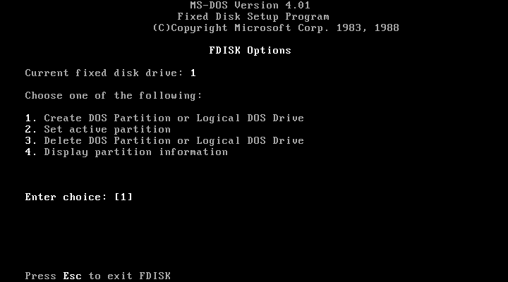
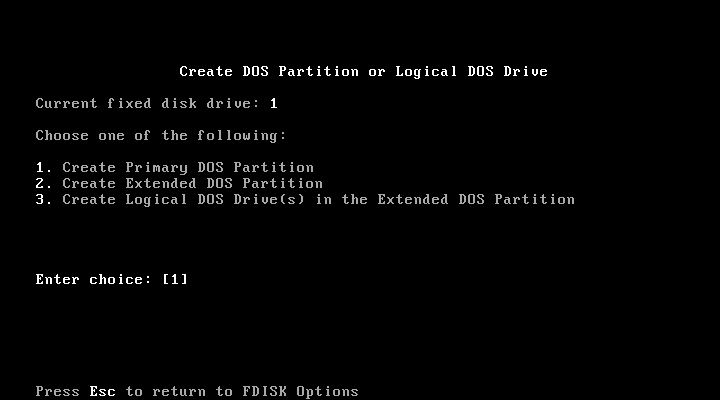
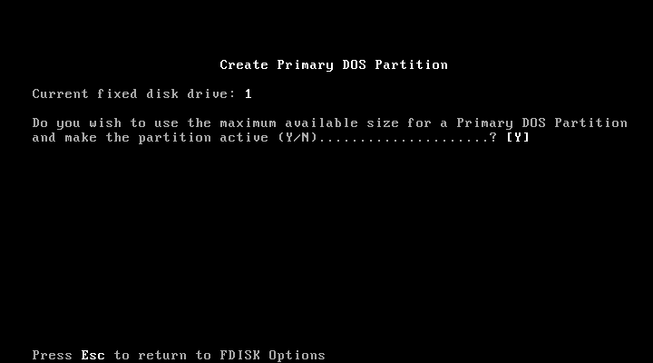
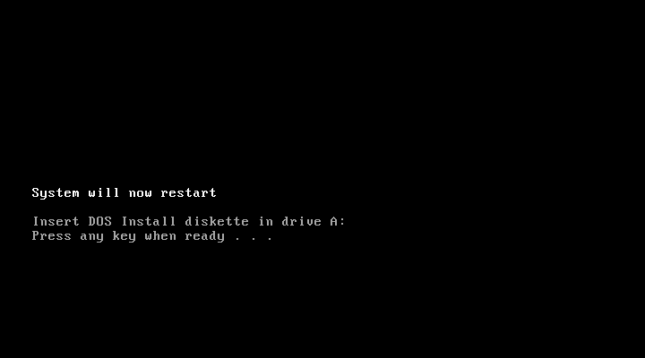
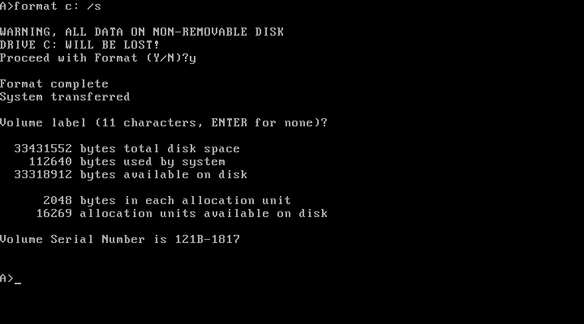
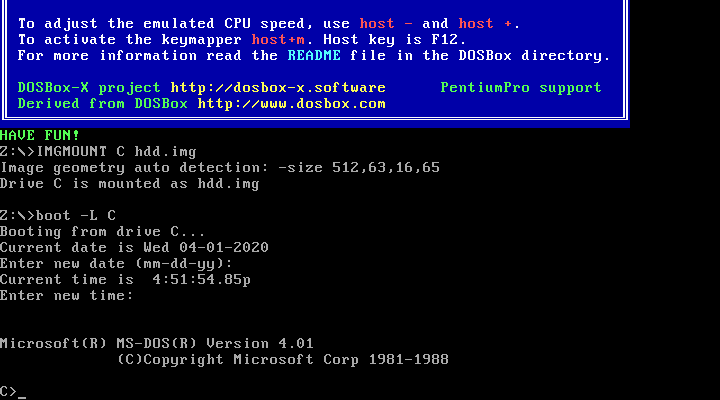

# PC-DOS and MS-DOS Installation Guide

This guide explains how to boot regular IBM PC-DOS or Microsoft MS-DOS in DOSBox-X, including creating hard disk images.

Before going through this guide, consider if you really need this as the integrated DOS functionality in DOSBox-X is more convenient for typical use-cases. Booting regular DOS is normally not necessary to run DOS applications such as games, or even Windows version up to 3.11 in DOSBox-X. And even if you have a application that requires a specific DOS version, you can change the reported version of the integrated DOS in DOSBox-X. There are two ways to change the DOS version:
1. There is a setting "ver" under the [dos] section in dosbox.conf. For example, setting "ver = 7.10" will cause DOSBox-X to set the initial DOS version as 7.10, instead of the default 5.00. Note that LFN (long filename) support will be enabled when the initial version is set to 7.0 or higher.
2. You can also set reported DOS version with the ``VER`` command in the DOSBox-X command line. For example, ``VER SET 6 22`` will cause DOSBox-X to claim to be version 6.22. Note that this method will only change the reported DOS version, but will not affact LFN support.

Some disadvantages of booting regular DOS in DOSBox-X includes:
- Inability to use the ``MOUNT`` command to access directories on the host filesystem. All storage will have to be in the form of images.
- If you need to access a CD-ROM you need to load a driver
- If you need a mouse, you need to load a driver
- Less free memory in the lower 640KB range, and having to tune available memory by selectively loading drivers high.

## General guidelines
This document assumes that you have PC-DOS or MS-DOS disk images. Getting these images files is outside the scope of this document.

### DOS versions
Unless noted otherwise, the PC-DOS and MS-DOS versions are equivalent for this document. There are various limitations that DOS imposes that are dependant on the version. A few milestones:

- PC-DOS version 1.0, supports only 5.25" 8-sector 160KB (SSDD) diskettes
- PC-DOS version 1.1, adds support for 5.25" 8-sector 320KB (DSDD) diskettes
- MS-DOS version 1.25, first version available to other OEMs
- DOS version 2.0
  - First to support HDDs up to 16MB (sometimes 32MB with vendor specific tools)
  - First to support 5.25" 180KB (SSDD) and 360KB disks (DSDD)
- DOS version 3.0
  - First version to support FAT16 partitions up to 32MB
  - First version to support 5.25" 1.2MB disks (HD)
- DOS version 3.2 first version to support 3.5" 720kB disks (2DD)
- DOS version 3.3
  - First version to support extended and logical partitions
  - First version to support HDDs up to 504MB
  - First version to support 3.5" 1.44MB disks (HD)
- PC-DOS version 4.0 was limited to 4 partitions of 1024MB each
- MS-DOS version 4.0
  - First version to allow HDDs up to 4,095MB with up to two partitions (primary of up to 2,047MB and a logical of up to 2,039MB)
  - First version to included HIMEM.SYS XMS 2.x driver with support for up to 16MB RAM
- MS-DOS version 5.0
  - First version to support 3.5" 2.88MB disks (ED)
  - First version to support HDDs up to 7.84GB
- MS-DOS version 6.0 included an updated HIMEM.SYS XMS 3.x driver with support for up to 64MB RAM
- MS-DOS version 7.0 (included in Windows 95 and 95A)
  - First version to support VFAT
  - First version to allow up to 4GB RAM
  - First version to support HDDs up to 32GB (CHS type only)
- MS-DOS version 7.1 (included in Windows 95 OSR2, 98 and 98SE)
  - First version to support FAT32
  - First version to support LBA for HDDs up to 2TB (although FDISK requires patch to support HDD size greater than 64GB)

### DOS editions
MS-DOS was licensed by many clone manufacturers and in the early days these OEM editions were often 'personalized' to the manufacturer, and therefore it is possible that these older OEM specific editions don't work in DOSBox-X.

## Booting DOS from disks
Booting DOS from a disk image is pretty straight forward. Start DOSBox-X and you should find yourself at the DOSBox-X ``Z:\>`` prompt. This is not real DOS, but a 'simulated' DOS that is compatible with most DOS games and applications. Now type something equivalent to
```
 BOOT dos.img
```
Assuming that dos.img is an uncompressed DOS disk image in your current working directory, it should start it. This even works for IBM PC-DOS 1.00.

<br>
## Creating a DOS 2.0 HDD image
Maximum HDD size depends on the OEM version, and should be 16 or 32MB.

|DOS|OEM|Maximum partition size|Note|
|---|---|----------------------|----|
|PC-DOS 2.00|IBM|32MB||
|PC-DOS 2.10|IBM|32MB||

TBD...

## Creating a DOS 3.0-3.21 HDD image
<i>Note:</i> The maximum partition size is supposed to be 32MB, but in reality this only is the case for PC-DOS 3.0 and 3.1. Other DOS versions are in practice limited to 31MB, or their ``FDISK`` tool is simply incompatible with DOSBox-X. For this reason the below examples will use 31MB for maximum compatibility between DOS versions.

|DOS|OEM|Maximum partition size|Note|
|---|---|----------------------|----|
|MS-DOS 3.10|Compaq|-|Incompatible FDISK|
|MS-DOS 3.10|HP|31MB|Fails to boot from diskette, this can be circumvented by renaming CONFIG.SYS. FDISK hangs with 32MB|
|MS-DOS 3.20|-|31MB|Will fail to boot with 32MB|
|MS-DOS 3.20|Tandy|31MB|Format error, and will fail to boot with 32MB|
|MS-DOS 3.21|-|31MB|Format error, and will fail to boot with 32MB|
|PC-DOS 3.0|IBM|32MB||
|PC-DOS 3.1|IBM|32MB||
|PC-DOS 3.2|IBM|31MB|Will fail to boot with 32MB|

<i>Note 2:</i> If you specify a different size then 31MB for the ``IMGMAKE`` command, pay close attention to the output of ``IMGMAKE`` as you will need to adjust the ``IMGMOUNT`` size parameter values accordingly.

The IMGMOUNT size parameter should have the format of: ``512,<sectors>,<heads>,<cylinders>``.

First you need to start DOSBox-X and create an empty HDD image file.

```
 IMGMAKE hdd.img -t hd -size 31 -nofs
 IMGMOUNT 2 hdd.img -t hdd -size 512,32,2,992 -fs none
```
<br>

You are now ready to boot the DOS diskette image:
```
 BOOT dos.img
```
Assuming that your uncompressed DOS 3.0-3.2 image is named dos.img and in your current working directory, it should boot DOS from the disk image.

<br>
These early DOS versions did not have an installer, so the preparation and installation is a manual process. You need to start with creating partitions.

Run ``FDISK`` and select option 1 to create a new DOS partition, and confirm you want to use the entire fixed disk for DOS.

<br>

<br>

After it is finished, press any key and DOS will reboot DOSBox-X and your again at the DOSBox-X ``Z:\>`` prompt. At this point the HDD image is partitioned, but not yet formatted or made bootable, so that is what you need to do next.
```
 IMGMOUNT 2 hdd.img -t hdd -size 512,32,2,992 -fs none
 BOOT dos.img
```
You have now again booted from the disk image, and are ready to format the C: and transfer the system files.
```
 FORMAT C: /S
```
<br>

You can optionally copy over the rest of the diskette contents at this point
```
 MKDIR C:\DOS
 COPY A:\*.* C:\DOS
```
You can also create a ``AUTOEXEC.BAT`` and ``CONFIG.SYS`` on the HDD with the included ``EDLIN`` editor.

From the DOSBox-X menu bar select Main and then select Reset guest system. You are again at the DOSBox-X ``Z:\>`` prompt.

Our setup is now complete and all that is left is how to boot the image normally. From the DOSBox-X ``Z:\>`` prompt this can be accomplished with
```
IMGMOUNT C hdd.img -size 512,32,2,992
BOOT -L C
```
You probably don't want to memorize those last two commands, so do yourself a favour and create yourself a DOSBox-X .conf file and place those commands in the [autoexec] section of that config file.

<i>Note:</i> You may notice that instead of using "2", we are now using "C". This is because the image is now partitioned and formatted and DOSBox is able to find the partition within it. The advantage of being able to address it as "C" is that you can access the files inside the HDD image from the DOSBox-X integrated DOS, making it easier to transfer files.

<i>Note 2:</i> Unfortunately we do still need to specify the drive geometry as DOSBox-X cannot autodetect it for DOS versions prior to 3.3.

<br>

## Creating a DOS 3.3 HDD image
Creating a DOS 3.3 HDD image is nearly identical to that of DOS 3.0-3.2 above with a few small notes
- DOSBox-X does not support creating Extended partitions
- The maximum HDD size is now 504MB but since DOSBox-X does not support Extended partitions, you are effectively limited to 32MB per image.
- DOS 3.3 does not suffer from the 31MB issue, so you can actually have a 32MB image.
- After you have created your image, due to the newer style partition layout, which DOSBox-X can autodetect, you do not have to specify the geometry to mount the image. So your can boot from the HDD image with the following commands instead.

```
IMGMOUNT C hdd.img
BOOT -L C
```

<br>

## Creating a PC-DOS 4.0 HDD image
TBD...

## Creating a MS-DOS 4.0x HDD image
First of all, consider if you really, really want to use MS-DOS 4.x as it was considered a very buggy release. If you decide to continue, and you have the choice, do yourself a favour and use the 3.5" version as it will minimize the amount of disk swapping required.

MS-DOS 4.0x on 5.25" media consists of the following six disks
 - Install
 - Select
 - Operating 1
 - Operating 2
 - Operating 3
 - Shell

MS-DOS 4.0x on 3.5" media consists of the following three disks
 - Setup
 - Operating
 - Shell

OEM versions could have additional disks such as a Diagnostic disk.

Starting with MS-DOS 4 the process to create a HDD image with DOSBox-X, should be easier. But unfortunately there is some kind of compatibility issue between DOSBox-X and the MS-DOS 4.0x installer. If you let DOSBox-X create a image that is already partitioned and formatted the MS-DOS 4.0x installer will not offer the option to install to the HDD.

In these examples we still use a 32MB HDD. MS-DOS 4.0x supports HDDs up to 4,095MB split into two partitions of 2,047MB and 2,048MB respectively. Since DOSBox-X supports only HDD images with primary partitions, 2,047MB should be our effective maximum HDD size, but through testing it was found that the FORMAT command supplied with MS-DOS 4.0x cannot handle drives larger than 2,019MB. Larger values will result in format immediately exiting with a "Divide overflow" error.

### Bare-bones install
If you decide to do just an absolute minimal install, and effectively skip the MS-DOS 4.0x install program, you don't need to worry about the buggy MS-DOS 4.0x installer.

```
 IMGMAKE hdd.img -t hd -size 32 -nofs
 IMGMOUNT 2 hdd.img -fs none
```
Now you need to boot from the first MS-DOS 4.0x disk, which is called either Setup or Install depending on the media type.
```
 BOOT SETUP.IMG
```
<br>

When at the Welcome screen (3.5" media) or prompted to insert the SELECT disk (5.25" media), simply press ESC instead followed by F3 to drop to the MS-DOS prompt

<br>

<br>

and run the following command:
```
 FDISK
```
<br>

Now select option 1 to create a DOS partition

<br>

Followed by option 1 to create a Primary DOS Partition

<br>

Confirm you want to use the maximum available size

<br>

And finally press any key to restart, to go back to the DOSBox-X ``Z:\>`` prompt.

At this point your image file is partitioned, but still needs to be formatted and made bootable. We first need to execute the exact same ``IMGMOUNT`` and ``BOOT`` commands from before.

```
IMGMOUNT 2 hdd.img -fs none
BOOT SETUP.IMG
```
You can now FORMAT the C: drive with the /S switch to transfer the system files.

<br>

The HDD image is now bootable and you can optionally copy some of the DOS utilities from the diskette to the HDD and create your ``CONFIG.SYS`` and ``AUTOEXEC.BAT``.

<br>

### Full install from 3.5" media
First of all the MS-DOS 4.0x installer can corrupt its own installation diskettes, as such you should change the permission of the disk images in the host OS such that the image files are READ-ONLY. In turn DOSBox-X will treat them as if the disks have the write-protect set.

You first need to create a HDD disk image without partition and filesystem and mount it.
```
 IMGMAKE hdd.img -t hd -size 32 -nofs
 IMGMOUNT 2 hdd.img -t hdd -size 512,63,2,520 -fs none
```
If you specify a different size value then 32MB for the IMGMAKE command, pay close attention to the output of IMGMAKE as you will need to adjust the IMGMOUNT size parameter values accordingly.
The IMGMOUNT size parameter should be 512,<sectors>,<heads>,<cylinders>.

During install, the installer will insist on a blank disk to be labelled "SELECT COPY". Unfortunately will it seems the installer should allow to use the B: drive for this purpose this does not seem to work in practice.
```
 IMGMAKE SELECT_COPY.IMG -t fd_720
 BOOT SETUP.IMG SELECT_COPY.IMG
```
For the first stage of the install, you only need to use the Setup and the blank disk (SELECT_COPY).

It is important that you keep track of the order of the disks that you specify on the BOOT line, as you will need to switch between them using either a keyboard shortcut or the "Swap floppy" option on the DOSBox-X menu bar located under the DOS heading. Unfortunately at this point there is no visual indication in DOSBox-X itself, as to which diskette is the current one inserted, you can however look at the DOSBox messages logged to the console if you have it open to see a message as to which disk is currently inserted. When you cycle through them one by one, once you reach the end, you will simply go back to the first.

Note that while the first MS-DOS 4.0x 3.5" disk is labelled "Setup" the installer will actually refer to it as "INSTALL".

Let the installer create the primary partition, and reset the guest system once it asks you to press Ctrl-Alt-Del. You will now be again at the DOSBox-X ``Z:\>`` prompt and you need to mount the images again. There is now a partition, but not yet a filesystem, and as such DOSBox-X's autodetect does not yet work and you still need to fully specify all the parameters again.
```
 IMGMOUNT 2 hdd.img -t hdd -size 512,63,2,520 -fs none
 BOOT SETUP.IMG SELECT_COPY.IMG OPERATING.IMG MSSHELL.IMG
```
Notice how we have now specified all the disks on the BOOT line, plus the SELECT_COPY disk. You need to go through all the installer questions a second time, and again you need to create the backup copy. Once you get to the partition question, select to skip and the install will then ask for the Operating and finally (if you elected to install it) the Shell disk. After this it will ask to reset the computer, so use the Reset guest system option in DOSBox-X to go back to the ``Z:\>`` prompt.

### Full install from 5.25" media
This process is basically the same as for the 3.5" media, but you have more disks and they are labelled differently.

### Booting MS-DOS 4.0x from HDD
Now that you have created a bootable HDD image you can boot it from the DOSBox-X ``Z:\>`` prompt with the following commands:
```
IMGMOUNT C hdd.img
BOOT -l C
```
## Creating a MS-DOS 5.0+ HDD image
TBD...
